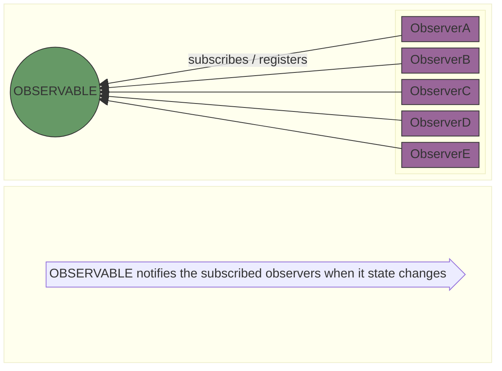

 ## Observer Pattern

#### DEFINITION : 
      The Observer Pattern defines a one-to-many dependency between objects(Subject and Observers) so that when 
      one object (subject) changes state, all of its dependents(observers) are notified and updated automatically.




   <br>
   <br>

   * Observer Pattern is more of migrating from <strong>POLL ARCHITECTURE</strong> to <strong>PUSH ARCHITECTURE</strong>.
      >
      > <strong>POLL ARCHITECTURE</strong>
      >> The OBSERVERS / SUBSCRIBERS poll from time to time to check if the OBSERVABLE's state has changed
      > 
      > <strong>PUSH ARCHITECTURE</strong>
      >> When OBSERVABLE / SUBJECT state changes, it notifies the OBSERVERS

  * How it works? 
     >
     > 1. OBSERVERS needs to register/ subscribe to OBSERVABLE 
     > 2. OBSERVABLE are being watched by OBSERVERS, So When OBSERVABLE state changes, OBSERVERS are notified.

  * Publishers(SUBJECT) + Subscribers(OBSERVER) = Observer Pattern
     >
     > 1. Publisher is also called Subject.
     > 2. Subscriber is also called Observer.    

   <br>
   <br>

   ```mermaid 
      classDiagram
         IObservable <|-- ConcreteObservable : implements 
         IObserver <|-- ConcreteObserver : implements  
         IObservable --> IObserver : [ 0..* ]( has many )***
         ConcreteObserver --> ConcreteObservable : ( has a )**
         
         class IObservable
            <<Interface>>  IObservable
            IObservable : -Set~IObserver~  observers
            IObservable : +add( IObserver  observer)
            IObservable : +remove( IObserver  observer)
            IObservable : +notify()
      
         class IObserver
            <<Interface>> IObserver
            IObserver : +update()

         class ConcreteObservable{
         -Set~IObserver~  observers
            +add( IObserver  observer)
            +remove( IObserver  observer)
            +notify()
            +getState()
         }  

         class ConcreteObserver{
         +update()
         }
  ``` 
  <br>
  <br>

  #### Example

  ```mermaid 
    classDiagram
   
    IObservable <|-- WeatherStation : implements 
    IObserver <|-- PhoneDisplay : implements  
    IObserver <|-- WindowDisplay : implements 
    IDisplay <|-- PhoneDisplay : implements  
    IDisplay <|-- WindowDisplay : implements  
    IObservable --> IObserver : [ 0..* ]( has many )
    PhoneDisplay --> WeatherStation : ( has a )
    WindowDisplay --> WeatherStation : ( has a )
   
   class IObservable
      <<Interface>>  IObservable
      IObservable : -Set~IObserver~  observers
      IObservable : +add( IObserver  observer)
      IObservable : +remove( IObserver  observer)
      IObservable : +notify()
  
   class IObserver
      <<Interface>> IObserver
      IObserver : +update()

   class WeatherStation{
     -Set~IObserver~  observers
      +add( IObserver  observer)
      +remove( IObserver  observer)
      +notify()
      +getTemperate()
   }  

   class PhoneDisplay{
     +update()
     +display()
   }

   class WindowDisplay {
      +update
      +display()
   }
  
   note for IDisplay "Not a part of Observer Pattern"
   class IDisplay
      <<Interface>> IDisplay
      IDisplay : +display() 
  ```  
  <br>
  <br>
  
  ```javascript
     /*
      Pseudo Code
      ============= 
      interface IObservable {
         add(IObserver observer)
         remove(IObserver observer)
         notify()
      }

      interface IObserver {
         update()
      }

      interface IDisplay {
         display()
      }

      class WeatherStation implements IObservable {
         Set IObserver observers

         public void add(IObserver observer) {
            this.observers = observer;
         }

         public void remove(IObserver observer){
            this.observers.remove(observer);
         }

         public void notify() {
            foreach(IObserver observer in this.observers) {
                  observer.update();
            }
         }

         public int getTemperature() {
            return this.temperature;
         }
      }

      class PhoneDisplay implements IObserver, IDisplay {
         IObservable station;
         
         public PhoneDisplay(IObservable observable) {
            this.station = observable;
         }

         public void update() {
            this.temperature = this.station.getTemperature();
         }
         }

         public void display() {
            
         }
      }

      class WeatherDisplay implements IObserver, IDisplay {

         IObservable station;
         
         public WeatherDisplay(IObservable observable) {
            this.station = observable;
         }

         public void update() {
            this.temperature = this.station.getTemperature();
         }

         public void display() {
            
         }
      }

      IObservable weatherStation = new WeatherStation();
      IObserver phoneDisplay = new PhoneDisplay(weatherStation);
      IObserver phoneDisplay = new PhoneDisplay(weatherStation); 
     
      // Subscribe to weatherStation( observable )
      weatherStation.add(phoneDisplay);
      weatherStation.add(windowDisplay);
      // notify
      weatherStation.notify();

    */
  ``` 

  ``` javascript


   class IObservable {
      add(observer) {}
      remove(observer) {}
      notify() {}
   }

   class IObserver {
      update() {}
   }

   class IDisplay {
      display() {}
   }

   class RadioStation extends IObservable {
      observers = new Set();
      add(observer) {
         this.observers.add(observer);
      }

      remove(observer) {
         this.observers.delete(observer);
      }

      notify() {
         observers.forEach((observer) => observer.update());
      }
   }

   const IDisplay = (superclass) =>
      class extends superclass {
         display() {}
   };

   // Mixin
   class MixinBuilder {
      constructor(superclass) {
         this.superclass = superclass;
      }
      with(...mixins) {
         return mixins.reduce((c, mixin) => mixin(c), this.superclass);
      }
   }

   // this will combine everything in one class
   const mix = (superclass) => new MixinBuilder(superclass);


   class PhoneDisplay extends mix(IObserver).with(IDisplay){
      observable;   
      temperature;

      constructor(observable) {
         observable = observable;
      }

      update() {
         this.temperature = observable.getTemperature();
      }

      display() {
      console.log("Phone Display", temperature)
      }
   }

   class WindowDisplay extends mix(IObserver).with(IDisplay) {
      observable;
      temperature;

      constructor(observable) {
         observable = observable;
      }

      update() {
         this.temperature = observable.getTemperature();
      }

      display() {
      console.log("Window Display", temperature)
      }
   }

  // Program Flow

      let weatherStation = new WeatherStation();
      let phoneDisplay = new PhoneDisplay(weatherStation);
      let windowDisplay = new WindowDisplay(weatherStation);
      /*
      IObservable weatherStation = new WeatherStation();
      IObserver phoneDisplay = new PhoneDisplay(weatherStation);
      IObserver phoneDisplay = new PhoneDisplay(weatherStation); 
      */
      // Subscribe to weatherStation( observable )
      weatherStation.add(phoneDisplay);
      weatherStation.add(windowDisplay);
      // notify
      weatherStation.notify();
```

* Points: 

  > 1. With the Observer Pattern, the Subject is the object that contains the state and controls it. So, there is ONE subject with state. The observers, on the other hand, use the state, even if they don’t own it. There are many observers, and they rely on the Subject to tell them when its state changes. So there is a relationship between the ONE Subject to the MANY Observers.

  > 2. The **Publish-Subscribe Pattern** is a more complex pattern that allows subscribers to express interest in different types of messages and further separates publishers from subscribers. It is often used in middleware systems.

  > 3. **Loose Coupling** - We say a object is tightly coupled to another object when it is too dependent on that object. In software, designs break less easily if our objects are less tightly bound together. **Program to an interface(Supertype), not an implementation.**


* ### Observer Pattern is a great example of loose coupling.

  > 1. The only thing the Subject knows about an Observer is that it
   implements a certain interface (the Observer interface).

  > 2. We can add new observers at any time.

  > 3. We never need to modify the subject to add new types of observers.

  > 4. We can reuse subjects or observers independently of each other.

  > 5. Changes to either the subject or an observer will not affect the other.

##### eg : A newspaper subscription, with its publisher and subscribers, is a good way to visualize the pattern.
