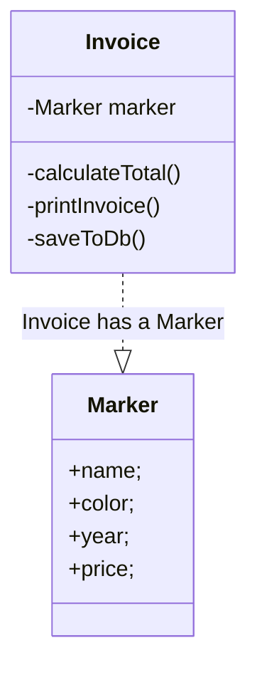
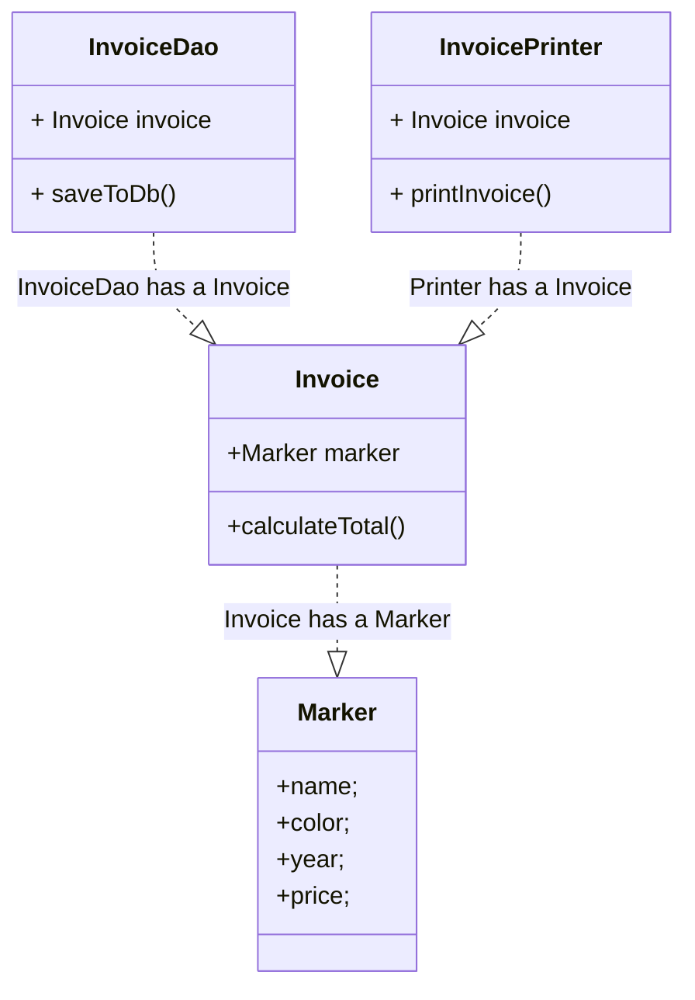

## Single Responsibility Principle

Class should have single responsibility. </br>
Class should have a single reason to change. 
</br>




</br>
</br>

``` javascript
class Marker {
  name;
  color;
  year;
  price;

  constructor(name, color, year, price) {
    this.name = name;
    this.color = color;
    this.year = year;
    this.price = price;
  }
}
```

```javascript
class Invoice {
  marker;
  quantity;

  constructor(marker, quantity) {
    this.marker = marker;
    this.quantity = quantity;
  }

  calculateTotal() {
    price = this.marker.price * this.quantity;
    return price;
  }

  printInvoice() {
    // print the invoice
  }

  saveToDb() {
    // Save data to DB
  }
}
```
</br>

#### The Invoice Class can change for 3 reasons: 
1. calculateTotal()
2. printInvoice() 
3. saveToDb()
   

#### Invoice Class does not follow Single Responsibility Principle
</br>
</br>

 
</br>




```javascript
class Invoice {
  marker;
  quantity;

  constructor(marker, quantity) {
    this.marker = marker;
    this.quantity = quantity;
  }

  calculateTotal() {
    price = this.marker.price * this.quantity;
    return price;
  }
}

class InvoiceDao {
  invoice;

  constructor(invoice) {
    this.invoice = invoice;
  }

  saveToDb() {
    // Save data to DB
  }
}

class InvoicePrinter {
  invoice;

  constructor(invoice) {
    this.invoice = invoice;
  }

  printInvoice() {
    // print the invoice
  }
}

```
</br>