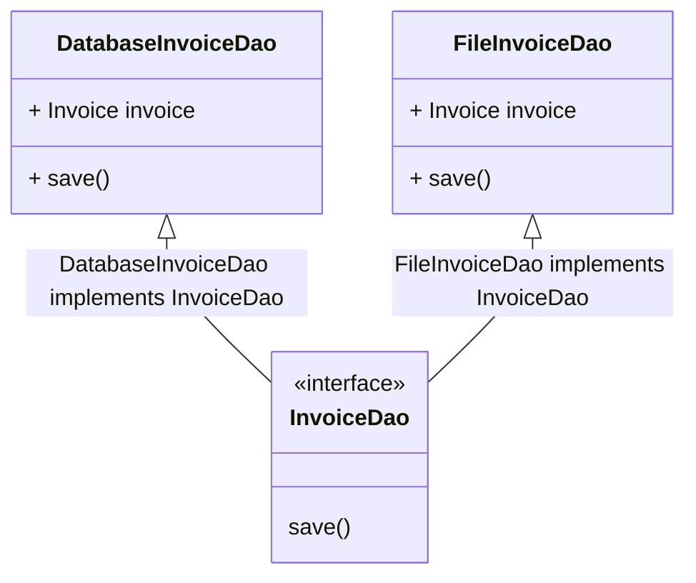

##  OPEN / CLOSE Principle

Class should be open for extension but close for modifications.
<br/>

```javascript
class InvoiceDao {
  invoice;

  constructor(invoice) {
    this.invoice = invoice;
  }

  saveToDb() {
    // Save data to DB
  }
}
```

#### Incase, InvoiceDao has got a new requirement to save it to files.
- Never reopen the class that has been tested and working in production.
- Reopening existing class, has a high chance to introducing bugs to the existing class.


### We should never reopen and existing class:

```javascript
class InvoiceDao {
  invoice;

  constructor(invoice) {
    this.invoice = invoice;
  }

  saveToDb() {
    // Save data to DB
  }

  saveToFile(fileName) {
    // Save invoice in the file with given name
  }
}
```

### Preferred Way: 




```javascript
// Interface
class InvoiceDao {
  save() {
    throw new Error("NotImplementedError");
  }
}

class DatabaseInvoiceDao extends InvoiceDao {
  invoice;

  constructor(invoice) {
    this.invoice = invoice;
  }

  save() {
    // Save data to DB
  }
}

class FileInvoiceDao extends InvoiceDao {
  invoice;

  constructor(invoice) {
    this.invoice = invoice;
  }
  
  save() {
    // Save data to FILE
  }
}
```