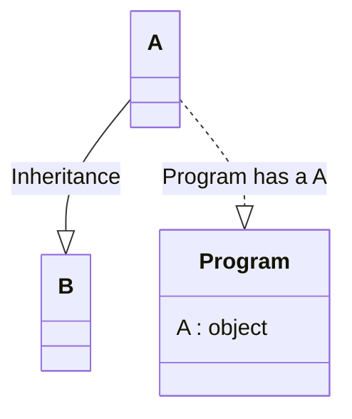
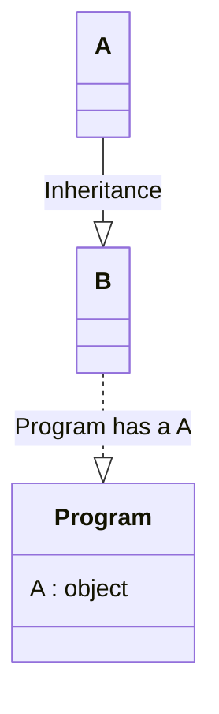

## LISKOV SUBSTITUTION principle

  IF Class B is subtype of Class A, then we should be able to replace object A with B without breaking the behavior of the program.

  Subclass should extend the capability of parent class not narrow it down




#### Passing B as the object to Program should not break the Program code



#### This could be achieved if only Subclass B have extended the capability of parent class A not narrow it down.


```javascript

// Interface
class Bike {
  turnOnEngine() {
    throw new Error("NotImplementedError");
  }

  accelerate() {
    throw new Error("NotImplementedError");
  }
}

class MotorCycle extends Bike {
  isEngineOn = false;
  speed = 0;

  turnOnEngine() {
    // turn on engine
    this.isEngineOn = true;
  }

  accelerate() {
    // increase speed
    speed += 10;
  }
}

class BiCycle extends Bike {
  turnOnEngine() {
    throw new Error("there is no engine");
  }
  accelerate() {
    // increase speed
    speed += 10;
  }
}

class Machine {
  // any object that implements Bike interface
  bike;

  constructor(bike) {
    this.bike = bike;
  }

  ride() {
    this.bike.turnOnEngine();
    this.bike.accelerate();
  }
}

```

- Machine object can accept both MotorCycle and BiCycle object. 
- But Bicycle object does not have an engine. Hence Machine object breaks the ride functionality of Machine.
- BiCycle class violates LISKOV SUBSTITUTION principle

