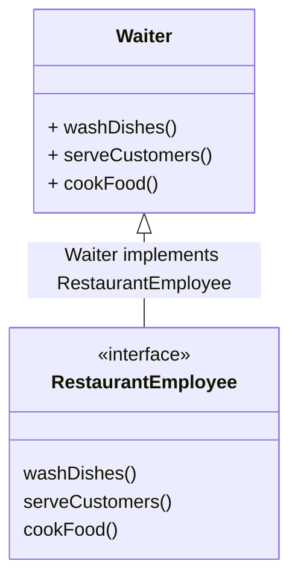

### Interface Segmented Principle

Interfaces should be such that client should not implement unnecessary functions they do not need 



<br/>

```javascript
// interfaces
class RestaurantEmployee {
  washDishes() {
    throw new Error("NotImplementedError");
  }
  serveCustomers() {
    throw new Error("NotImplementedError");
  }
  cookFood() {
    throw new Error("NotImplementedError");
  }
}

/*
  Waiter( Client) should not be implementing washDishes and cookFood
*/

class Waiter extends RestaurantEmployee {
  washDishes() {
    //not my job
  }

  serveCustomers() {
    console.log("Serving Customers");
  }

  cookFood() {
    // not my job
  }
}
```

 #### Waiter( Client) should not be implementing washDishes and cookFood
 #### Waiter violates Interface Segmented Principle

 ### What is the fix?

 #### Segregate / Segment the large interface into smaller interfaces such that clients implementing them have to implement only the required functionalities
 <br/>

 ```mermaid
classDiagram
Waiter <|-- WaiterInterface : Waiter implements WaiterInterface
  
class WaiterInterface
 <<interface>> WaiterInterface
 WaiterInterface : takeOrders()
 WaiterInterface : serveCustomers()
 

 class ChefInterface
 <<interface>> ChefInterface
 ChefInterface : cookFood()
 ChefInterface : decideMenu()


class Waiter {
  + takeOrders()
  + serveCustomers()
}
```
<br/>

```javascript
class WaiterInterface {
  takeOrders() {
    throw new Error("NotImplementedError");
  }

  serveCustomers() {
    throw new Error("NotImplementedError");
  }
}

class ChefInterface {
  cookFood() {
    throw new Error("NotImplementedError");
  }

  decideMenu() {
    throw new Error("NotImplementedError");
  }
}

class Waiter extends WaiterInterface {
  serveCustomers() {
    console.log("Serving Customers");
  }

  takeOrders() {
    console.log("Taking Orders");
  }
}
```