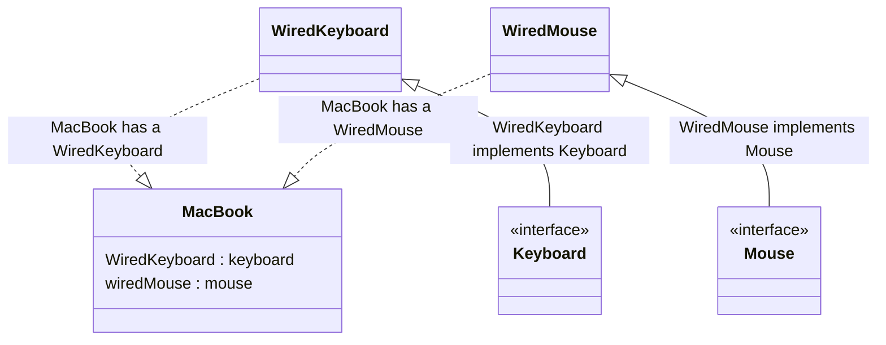
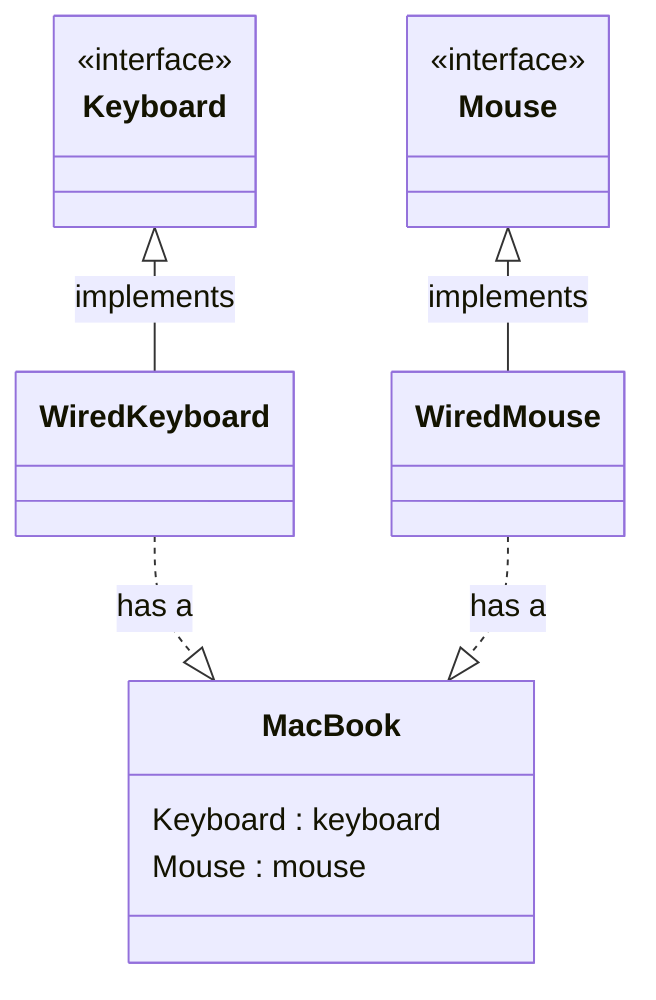

### Dependency Injection Principle


- High-level components should not depend on low-level components,
instead, they should both depend on abstractions. 

### A high-level component is a class with behavior defined in terms of other low-level components.

- Class Should depend on interfaces rather than concrete classes


####  1. Classes should accept objects of concrete type.
####  2. Classes should accept objects of interfaces type. So that it can accept any object that implements the interface.
<br/>


<br/>

```javascript
// Keyboard interface
class Keyboard {}

// Mouse interface
class Mouse {}

class wiredKeyboard extends Keyboard {
  // wiredKeyboard implementation
}

class wiredMouse extends Mouse {
  // wiredMouse implementation
}

class MacBook {
  // WiredKeyboard keyboard
  // WiredMouse mouse
  wiredKeyboard;
  wiredMouse;

  constructor(wiredKeyboard, wiredMouse) {
    this.wiredKeyboard = keyboard;
    this.wiredMouse = mouse;
  }
}
```
<br/>

### What is the fix?
####  Classes should accept objects of interfaces type. So that it can accept any object that implements the interface in future.
<br/>
<br/>


<br/>


```javascript
// Keyboard interface
class Keyboard {}

// Mouse interface
class Mouse {}

class wiredKeyboard extends Keyboard {
  // wiredKeyboard implementation
}

class wiredMouse extends Mouse {
  // wiredMouse implementation
}

class wirelessKeyboard extends Keyboard {
  // wirelessKeyboard implementation
}

class wirelessMouse extends Mouse {
  // wirelessMouse implementation
}

class MacBook {
  // Keyboard keyboard
  // Mouse mouse
  keyboard;
  mouse;
  constructor(keyboard, mouse) {
    this.keyboard = keyboard;
    this.mouse = mouse;
  }
}

```